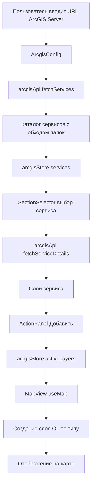

# План реализации приложения arcgis2openlayers

## Описание задачи

Создать картографическое веб-приложение на React 18 + TypeScript под названием `arcgis2openlayers`, которое подключается к ArcGIS Server, получает список сервисов и слоёв и подключает выбранные слои на карту OpenLayers.

## Технологический стек

| Технология | Версия | Назначение |
|------------|--------|-----------|
| React | 18.2.0 | UI фреймворк |
| TypeScript | 5.0.2 | Типобезопасная разработка |
| Vite | 4.4.5 | Сборщик и сервер разработки |
| TailwindCSS | 3.3.5 | Utility-first CSS фреймворк |
| Zustand | 4.4.0 | Управление состоянием |
| OpenLayers | Latest | Библиотека для карт |
| lucide-react | 0.263.1 | Библиотека иконок |
| react-hot-toast | 2.6.0 | Всплывающие уведомления |
| clsx | 2.0.0 | Условное объединение имён классов |
| tailwind-merge | 1.14.0 | Объединение Tailwind-классов |

## Ключевые архитектурные решения

1. Подключение к ArcGIS Server через нативный REST API:
   - Каталог сервисов: `GET {server}/arcgis/rest/services?f=pjson` — корневой список сервисов и папок.
   - Обход вложенных папок: `GET {server}/arcgis/rest/services/{folder}?f=pjson`.
   - Детали сервиса: `GET {server}/arcgis/rest/services/{service}/{ServiceType}?f=pjson`.

2. Сопоставление типов сервисов и слоёв OpenLayers:

| Тип ArcGIS Server | Слой OpenLayers |
|---|---|
| `MapServer` без кеша | `ImageLayer` + `ImageArcGISRest` |
| `MapServer` с `singleFusedMapCache: true` | `TileLayer` + `XYZ` через `/tile/{z}/{y}/{x}` |
| `FeatureServer` | `VectorLayer` + `VectorSource` (GeoJSON из `/query?f=geojson`) |
| `ImageServer` | `ImageLayer` + `ImageArcGISRest` |

3. Подложки (базовые карты): OpenStreetMap + Esri World Imagery.
4. Аутентификация: сейчас только публичные сервисы, но в интерфейсе закладывается поле токена (пробрасывается в запросы как `?token=`).
5. Вся логика называется `arcgis` (types, store, service, компонент конфигурации), а не `geoserver`, поскольку приложение работает с ArcGIS Server.

## Диаграмма потока данных



## Структура проекта

```
arcgis2openlayers/
├── index.html
├── package.json
├── tsconfig.json
├── tsconfig.node.json
├── vite.config.ts
├── tailwind.config.js
├── postcss.config.js
└── src/
    ├── main.tsx
    ├── App.tsx
    ├── index.css
    ├── lib/
    │   └── utils.ts
    ├── types/
    │   └── arcgis.ts
    ├── stores/
    │   ├── arcgisStore.ts
    │   └── themeStore.ts
    ├── services/
    │   └── arcgisApi.ts
    ├── hooks/
    │   └── useMap.ts
    └── components/
        ├── ArcgisConfig.tsx
        ├── MapView.tsx
        ├── SectionSelector.tsx
        ├── ActionPanel.tsx
        ├── StatusBar.tsx
        ├── InfoDialog.tsx
        ├── BottomPanel.tsx
        ├── BasemapSelector.tsx
        └── SettingsModal.tsx
```

## Управление состоянием

- `arcgisStore.ts` — URL сервера, каталог сервисов, выбранный сервис, слои, активные слои на карте, базовая карта, состояния загрузки и ошибок.
- `themeStore.ts` — светлая/тёмная тема с сохранением в `localStorage`.

## Шаги реализации

1. Инициализировать проект: `package.json`, `vite.config.ts`, `tsconfig.json`, `tsconfig.node.json`, `tailwind.config.js`, `postcss.config.js`, `index.html`.
2. Создать точку входа: `src/main.tsx`, `src/App.tsx`, `src/index.css` с импортами TailwindCSS.
3. Создать вспомогательную функцию `cn` в `src/lib/utils.ts` (clsx + tailwind-merge).
4. Описать типы ArcGIS REST API в `src/types/arcgis.ts` (каталог сервисов, сервис, слои, поля, параметры подключения).
5. Реализовать сервисный слой `src/services/arcgisApi.ts`: каталог сервисов с обходом папок, детали сервиса и слоёв, определение источника (Map/Feature/Image/Tile), поддержка `?f=pjson`.
6. Создать Zustand store `src/stores/arcgisStore.ts`: URL сервера, каталог сервисов, выбранный сервис, слои, активные слои на карте, базовая карта, состояния загрузки/ошибок.
7. Создать `src/stores/themeStore.ts`: светлая/тёмная тема с сохранением в `localStorage`.
8. Реализовать базовые подложки: OpenStreetMap и Esri World Imagery + компонент выбора базовой карты `BasemapSelector.tsx`.
9. Создать `src/components/MapView.tsx` и хук `src/hooks/useMap.ts`: создание карты OpenLayers, синхронизация слоёв из store, добавление/удаление слоёв.
10. Создать `src/components/ArcgisConfig.tsx`: ввод URL ArcGIS Server, подключение, загрузка каталога, задел под токен.
11. Создать `src/components/SectionSelector.tsx`: выпадающий список сервисов и слоёв с группировкой и выбором.
12. Создать `src/components/ActionPanel.tsx`: кнопки «Добавить слой» и «Удалить слой».
13. Создать `src/components/StatusBar.tsx`: счётчик выбранных/всего слоёв.
14. Создать `src/components/InfoDialog.tsx`: диалог информации о слое (название, описание, поля, extent).
15. Создать `src/components/BottomPanel.tsx`: панель сообщений и ошибок.
16. Создать `src/components/SettingsModal.tsx`: настройки (тема, базовая карта, будущее поле токена).
17. Стилизовать UI через TailwindCSS, подключить `react-hot-toast` и переключение тем.
18. Проверить сборку: `npm install`, `npm run build`, исправить ошибки типов.
19. Обновить `README.md` с описанием и командами разработки.

## Команды разработки

```bash
npm install          # Установка зависимостей
npm run dev          # Запуск сервера разработки (http://localhost:5173)
npm run build        # Сборка для продакшена
npm run preview      # Предпросмотр продакшен-сборки
```

## Примечания

- Если ArcGIS Server не разрешает CORS-запросы, потребуется прокси или настройка CORS на сервере; ошибки выводятся в `BottomPanel` и через `react-hot-toast`.
- Поле токена закладывается в UI заранее, но не используется, пока не будет добавлена поддержка защищённых сервисов.
